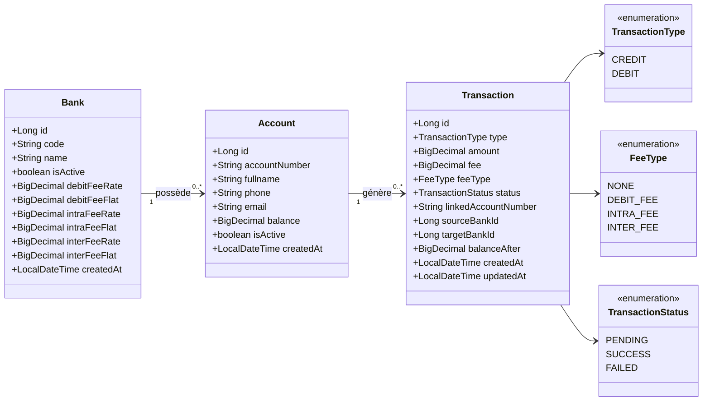
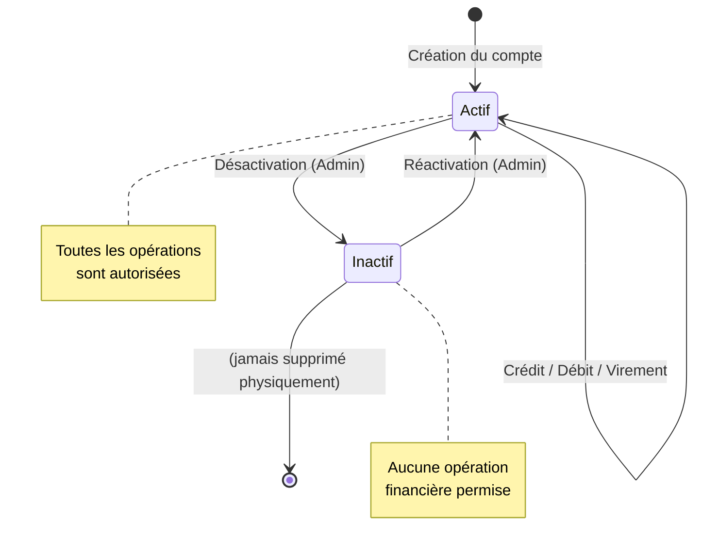
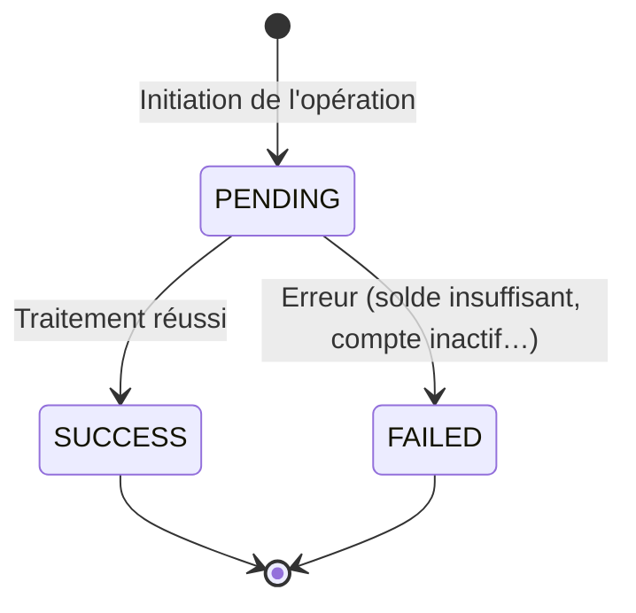
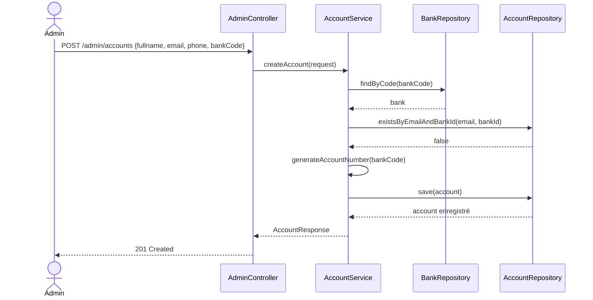
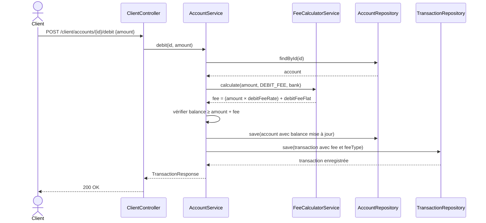
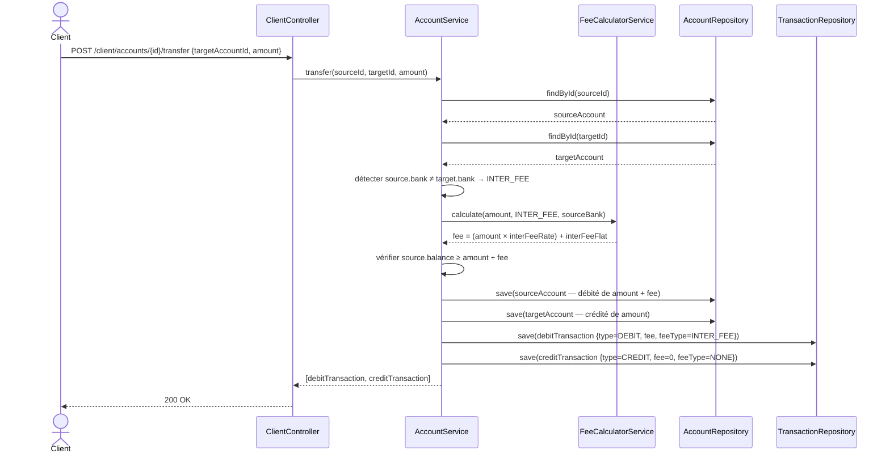

# CAHIER DES CHARGES TECHNIQUE
## Système Bancaire Multi-Institutions avec Gestion des Frais de Transaction

---

<div align="center">

| | |
|---|---|
| **Projet** | Banking API v2.0 — Extension Multi-Banques |
| **Auteur** | DJINE SINTO PAFING — Matricule 23U2292 |
| **Contact** | dsintopafing@gmail.com |
| **Cours** | ICT304 — Software Testing & Quality Assurance |
| **Institution** | ICTL3 — 2025-2026, Semestre 2 |
| **Version** | 2.0.0 |
| **Date** | 06 Mai 2026 |

</div>

---

## TABLE DES MATIÈRES

1. [Présentation du Projet](#1-présentation-du-projet)
2. [Description de l'Existant](#2-description-de-lexistant)
3. [Besoins Fonctionnels](#3-besoins-fonctionnels)
4. [Besoins Non-Fonctionnels](#4-besoins-non-fonctionnels)
5. [Modélisation](#5-modélisation)
6. [Architecture Technique](#6-architecture-technique)
7. [Modèle de Données](#7-modèle-de-données)
8. [Description des Interfaces](#8-description-des-interfaces)
9. [Règles de Gestion](#9-règles-de-gestion)
10. [Glossaire](#10-glossaire)

---

## 1. PRÉSENTATION DU PROJET

### 1.1 Contexte

Dans le cadre du cours ICT304 — *Software Testing and Quality Assurance*, un système de gestion bancaire a été développé en version 1.0. Cette première version permet la gestion de comptes bancaires génériques au sein d'une institution unique, sans distinction entre les différentes banques et sans mécanisme de tarification des opérations.

La version 2.0 objet du présent cahier des charges vise à étendre ce système vers une **plateforme bancaire multi-institutions**, en intégrant cinq banques actives sur le marché camerounais et en dotant le système d'un **moteur de calcul des frais de transaction** adapté à chaque type d'opération.

### 1.2 Banques Concernées

Le système est conçu pour accueillir plusieurs établissements bancaires. Dans le cadre de ce projet, les banques suivantes sont enregistrées par l'administrateur :

| Code | Dénomination Sociale                   |
|------|----------------------------------------|
| UBA  | United Bank for Africa                 |
| CCA  | Crédit Communautaire d'Afrique         |
| SGC  | Société Générale Cameroun              |
| ECO  | Ecobank Cameroun                       |
| AFL  | Afriland First Bank                    |

### 1.3 Objectifs

Le système version 2.0 doit satisfaire les objectifs suivants :

- **O1** — Représenter chaque banque comme une entité à part entière, dotée de ses propres paramètres de tarification.
- **O2** — Associer chaque compte bancaire à une banque d'appartenance identifiée.
- **O3** — Générer automatiquement un numéro de compte unique par banque, selon un format normalisé.
- **O4** — Calculer et prélever automatiquement des frais lors des opérations de débit et de virement.
- **O5** — Distinguer les virements intra-bancaires (au sein d'une même banque) des virements inter-bancaires (entre banques différentes), ces deux types étant soumis à des tarifications distinctes.
- **O6** — Assurer une traçabilité complète de chaque opération, y compris le détail des frais appliqués.
- **O7** — Offrir des indicateurs statistiques par banque (volume de transactions, frais collectés).

### 1.4 Périmètre

**Inclus dans le périmètre :**
- Gestion des cinq banques et de leurs paramètres de frais
- Création et gestion de comptes rattachés à une banque
- Opérations bancaires : crédit, débit, virement intra-bancaire, virement inter-bancaire
- Calcul automatique et enregistrement des frais de transaction
- Consultation du solde et de l'historique des transactions par compte
- Consultation de statistiques par banque
- Documentation API via Swagger/OpenAPI

**Hors périmètre :**
- Authentification et contrôle d'accès (JWT, OAuth2)
- Interface utilisateur graphique
- Gestion multi-devises (le système opère exclusivement en XAF — Franc CFA)
- Gestion de produits financiers (prêts, épargne, crédit)
- Notifications (SMS, email)
- Intégration avec des systèmes bancaires réels

---

## 2. DESCRIPTION DE L'EXISTANT

### 2.1 Système Actuel (v1.0)

Le système existant est une API REST développée avec **Spring Boot 4.0.5** et **Java 21**, utilisant une base de données **SQLite** embarquée. Il expose deux groupes d'endpoints :

- **Interface Admin** (`/admin/accounts`) : création, désactivation et réactivation de comptes, liste de tous les comptes.
- **Interface Client** (`/client/accounts`) : consultation du solde, historique des transactions, crédit, débit et virement entre comptes.

### 2.2 Limites de la Version Actuelle

| Limitation | Impact |
|---|---|
| Aucune notion de banque — tous les comptes appartiennent à une entité unique | Impossible de distinguer les opérations selon l'institution |
| Absence de frais sur les transactions | Le système ne reflète pas la réalité bancaire |
| Numéro de compte auto-incrémenté sans préfixe | Pas de traçabilité de la banque dans le numéro |
| Un seul compte par email autorisé | Un client ne peut pas avoir de comptes dans plusieurs banques |

---

## 3. BESOINS FONCTIONNELS

### BF-01 — Gestion des Banques

| Réf. | Description | Priorité |
|------|-------------|----------|
| BF-01.1 | Un administrateur peut créer une nouvelle banque en fournissant son code, sa dénomination et ses paramètres de frais. | Haute |
| BF-01.2 | Chaque banque est caractérisée par un code unique, une dénomination et six paramètres de frais. | Haute |
| BF-01.3 | Un administrateur peut consulter la liste des banques et le détail de chacune. | Haute |
| BF-01.4 | Un administrateur peut activer ou désactiver une banque. | Moyenne |
| BF-01.5 | Un administrateur peut modifier les paramètres de frais d'une banque existante. | Moyenne |

### BF-02 — Gestion des Comptes

| Réf. | Description | Priorité |
|------|-------------|----------|
| BF-02.1 | Tout compte est obligatoirement rattaché à une banque lors de sa création. | Haute |
| BF-02.2 | Le numéro de compte est généré automatiquement par le système au format `CODE-XXXXXXXX`. | Haute |
| BF-02.3 | Un titulaire peut détenir un compte dans chacune des cinq banques. | Haute |
| BF-02.4 | Un titulaire ne peut détenir qu'un seul compte par banque, identifié par son adresse e-mail. | Haute |
| BF-02.5 | La liste des comptes peut être consultée globalement ou filtrée par banque. | Moyenne |
| BF-02.6 | Un compte peut être désactivé (soft delete) ou réactivé par un administrateur. | Haute |

### BF-03 — Opération de Crédit

| Réf. | Description | Priorité |
|------|-------------|----------|
| BF-03.1 | Une opération de crédit ajoute le montant spécifié au solde du compte. | Haute |
| BF-03.2 | Aucun frais n'est prélevé lors d'un crédit. | Haute |
| BF-03.3 | Le montant crédité doit être strictement supérieur à zéro. | Haute |
| BF-03.4 | Le compte destinataire doit être actif pour recevoir un crédit. | Haute |

### BF-04 — Opération de Débit

| Réf. | Description | Priorité |
|------|-------------|----------|
| BF-04.1 | Une opération de débit soustrait le montant demandé du solde du compte. | Haute |
| BF-04.2 | Des frais sont automatiquement calculés et déduits du solde en sus du montant demandé. | Haute |
| BF-04.3 | Le solde du compte doit être suffisant pour couvrir le montant **et** les frais associés. | Haute |
| BF-04.4 | Le compte doit être actif pour permettre un débit. | Haute |

### BF-05 — Virement Intra-Bancaire

| Réf. | Description | Priorité |
|------|-------------|----------|
| BF-05.1 | Un virement intra-bancaire transfère des fonds entre deux comptes appartenant à la même banque. | Haute |
| BF-05.2 | Des frais intra-bancaires sont prélevés sur le compte source. | Haute |
| BF-05.3 | Le compte destinataire reçoit exactement le montant demandé, sans déduction. | Haute |
| BF-05.4 | Les deux comptes impliqués doivent être actifs. | Haute |
| BF-05.5 | Le compte source doit disposer d'un solde couvrant le montant et les frais. | Haute |

### BF-06 — Virement Inter-Bancaire

| Réf. | Description | Priorité |
|------|-------------|----------|
| BF-06.1 | Un virement inter-bancaire transfère des fonds entre deux comptes de banques différentes. | Haute |
| BF-06.2 | Des frais inter-bancaires, plus élevés que les frais intra-bancaires, sont prélevés sur le compte source. | Haute |
| BF-06.3 | Le compte destinataire reçoit exactement le montant demandé, sans déduction. | Haute |
| BF-06.4 | Les deux banques impliquées sont tracées dans l'enregistrement de la transaction. | Haute |
| BF-06.5 | Les deux comptes impliqués doivent être actifs. | Haute |

### BF-07 — Traçabilité des Transactions

| Réf. | Description | Priorité |
|------|-------------|----------|
| BF-07.1 | Chaque transaction enregistre le montant des frais prélevés et leur type. | Haute |
| BF-07.2 | L'historique d'un compte liste toutes ses transactions par ordre chronologique décroissant. | Haute |
| BF-07.3 | Une transaction de virement référence le compte lié (source ou destination). | Haute |
| BF-07.4 | Une transaction inter-bancaire identifie les deux banques impliquées. | Haute |

### BF-08 — Statistiques et Reporting

| Réf. | Description | Priorité |
|------|-------------|----------|
| BF-08.1 | Le système expose le nombre total de comptes et de comptes actifs par banque. | Moyenne |
| BF-08.2 | Le système expose le volume total des transactions et les frais collectés par banque. | Moyenne |
| BF-08.3 | Le système expose des statistiques agrégées sur l'ensemble des banques. | Basse |

---

## 4. BESOINS NON-FONCTIONNELS

| Réf. | Catégorie | Exigence |
|------|-----------|----------|
| BNF-01 | Performance | Toute requête doit produire une réponse en moins de 500 ms dans des conditions normales d'utilisation. |
| BNF-02 | Atomicité | Chaque opération modifiant un ou plusieurs soldes est exécutée de manière atomique : soit elle réussit intégralement, soit elle est intégralement annulée. |
| BNF-03 | Précision numérique | Tous les montants sont manipulés en `BigDecimal` avec une précision de 15 chiffres significatifs et 2 décimales, conformément à la devise XAF. |
| BNF-04 | Compatibilité ascendante | Les endpoints existants de la version 1.0 conservent leur signature et leur comportement. |
| BNF-05 | Traçabilité | Toute modification de solde génère obligatoirement un enregistrement de transaction en base de données. |
| BNF-06 | Documentation | L'intégralité des endpoints est documentée et accessible via l'interface Swagger UI. |
| BNF-07 | Portabilité | Le système fonctionne avec une base SQLite embarquée, sans dépendance à un serveur de base de données externe. |

---

## 5. MODÉLISATION

### 5.1 Diagramme des Cas d'Utilisation

```
┌─────────────────────────────────────────────────────────────────────┐
│                        Système Bancaire v2.0                        │
│                                                                     │
│  ┌─────────────────────────────────────────┐                        │
│  │            Interface Admin              │                        │
│  │  ○ Créer une banque                     │                        │
│  │  ○ Consulter les banques                │                        │
│  │  ○ Modifier les frais d'une banque      │                        │
│  │  ○ Activer / Désactiver une banque      │◄──── «Administrateur» │
│  │  ○ Créer un compte                      │                        │
│  │  ○ Désactiver / Réactiver un compte     │                        │
│  │  ○ Lister les comptes                   │                        │
│  └─────────────────────────────────────────┘                        │
│                                                                     │
│  ┌─────────────────────────────────────────┐                        │
│  │            Interface Client             │                        │
│  │  ○ Consulter son solde                  │                        │
│  │  ○ Consulter l'historique               │◄──── «Client»         │
│  │  ○ Créditer un compte                   │                        │
│  │  ○ Débiter un compte                    │                        │
│  │  ○ Effectuer un virement intra-bancaire │                        │
│  │  ○ Effectuer un virement inter-bancaire │                        │
│  └─────────────────────────────────────────┘                        │
└─────────────────────────────────────────────────────────────────────┘
```

---

### 5.2 Diagramme de Classes



---

### 5.3 Diagramme d'États — Compte Bancaire



---

### 5.4 Diagramme d'États — Transaction



---

### 5.5 Diagramme de Séquence — Création d'un Compte



---

### 5.6 Diagramme de Séquence — Débit avec Frais



---

### 5.7 Diagramme de Séquence — Virement Inter-Bancaire



---

## 6. ARCHITECTURE TECHNIQUE

### 6.1 Stack Technologique

| Couche | Technologie | Version |
|--------|-------------|---------|
| Langage | Java | 21 |
| Framework applicatif | Spring Boot | 4.0.5 |
| Persistance | Spring Data JPA / Hibernate | Inclus |
| Base de données | SQLite (embarquée) | — |
| Documentation API | SpringDoc OpenAPI / Swagger UI | 2.8.6 |
| Outil de build | Maven | — |

### 6.2 Architecture en Couches

```
┌─────────────────────────────────────────────────┐
│                  Couche REST                    │
│   AdminController  ClientController  BankController  │
└────────────────────────┬────────────────────────┘
                         │
┌────────────────────────▼────────────────────────┐
│               Couche Métier (Services)          │
│   AccountService   BankService   FeeCalculatorService │
└────────────────────────┬────────────────────────┘
                         │
┌────────────────────────▼────────────────────────┐
│            Couche Accès aux Données             │
│   AccountRepository  BankRepository  TransactionRepository │
└────────────────────────┬────────────────────────┘
                         │
┌────────────────────────▼────────────────────────┐
│              Base de Données SQLite             │
│        banks   accounts   transactions          │
└─────────────────────────────────────────────────┘
```

### 6.3 Organisation des Packages

```
com.api.banking/
├── config/
│   ├── CorsConfig.java
│   └── OpenApiConfig.java
├── controller/
│   ├── AdminController.java
│   ├── ClientController.java
│   └── BankController.java
├── service/
│   ├── AccountService.java
│   ├── BankService.java
│   └── FeeCalculatorService.java
├── repository/
│   ├── AccountRepository.java
│   ├── BankRepository.java
│   └── TransactionRepository.java
├── entity/
│   ├── Account.java
│   ├── Bank.java
│   └── Transaction.java
├── dto/
│   ├── ApiResponse.java
│   ├── AccountResponse.java
│   ├── BankResponse.java
│   ├── CreateAccountRequest.java
│   ├── TransactionRequest.java
│   ├── TransactionResponse.java
│   └── TransferRequest.java
└── exception/
    ├── GlobalExceptionHandler.java
    ├── AccountAlreadyExistsException.java
    ├── AccountInactiveException.java
    ├── AccountNotFoundException.java
    ├── BankNotFoundException.java
    └── InsufficientBalanceException.java
```

---

## 7. MODÈLE DE DONNÉES

### 7.1 Table `banks`

Stocke les cinq banques et leurs paramètres de frais.

| Colonne | Type | Contrainte | Description |
|---------|------|------------|-------------|
| `id` | INTEGER | PK, AUTO | Identifiant technique |
| `code` | VARCHAR(5) | NOT NULL, UNIQUE | Code banque (UBA, CCA, SGC, ECO, AFL) |
| `name` | VARCHAR(100) | NOT NULL | Dénomination complète |
| `is_active` | BOOLEAN | NOT NULL, DEFAULT 1 | Statut de la banque |
| `debit_fee_rate` | DECIMAL(6,4) | NOT NULL | Taux de frais sur débit (ex : 0.005 = 0,5 %) |
| `debit_fee_flat` | DECIMAL(10,2) | NOT NULL | Montant fixe sur débit (en XAF) |
| `intra_fee_rate` | DECIMAL(6,4) | NOT NULL | Taux de frais virement intra-bancaire |
| `intra_fee_flat` | DECIMAL(10,2) | NOT NULL | Montant fixe virement intra-bancaire |
| `inter_fee_rate` | DECIMAL(6,4) | NOT NULL | Taux de frais virement inter-bancaire |
| `inter_fee_flat` | DECIMAL(10,2) | NOT NULL | Montant fixe virement inter-bancaire |
| `created_at` | DATETIME | NOT NULL | Date de création |

---

### 7.2 Table `accounts`

Stocke les comptes bancaires, chacun associé à une banque.

| Colonne | Type | Contrainte | Description |
|---------|------|------------|-------------|
| `id_account` | INTEGER | PK, AUTO | Identifiant technique |
| `account_number` | VARCHAR(20) | NOT NULL, UNIQUE | Numéro de compte (ex : UBA-00000001) |
| `bank_id` | INTEGER | FK → banks(id) | Banque d'appartenance |
| `fullname` | VARCHAR(100) | NOT NULL | Nom complet du titulaire |
| `phone` | VARCHAR(20) | NOT NULL, UNIQUE | Numéro de téléphone |
| `email` | VARCHAR(100) | NOT NULL | Adresse e-mail |
| `balance` | DECIMAL(15,2) | NOT NULL, DEFAULT 0 | Solde courant en XAF |
| `is_active` | BOOLEAN | NOT NULL, DEFAULT 1 | Statut du compte |
| `created_at` | DATETIME | NOT NULL | Date de création |

> **Contrainte d'unicité composite :** Un même e-mail ne peut être associé qu'à un seul compte par banque (`UNIQUE` sur `email, bank_id`).

---

### 7.3 Table `transactions`

Stocke l'historique de toutes les opérations financières.

| Colonne | Type | Contrainte | Description |
|---------|------|------------|-------------|
| `id_transaction` | INTEGER | PK, AUTO | Identifiant technique |
| `account_number` | VARCHAR(20) | NOT NULL | Numéro du compte concerné |
| `type` | VARCHAR(10) | NOT NULL | `CREDIT` ou `DEBIT` |
| `amount` | DECIMAL(15,2) | NOT NULL | Montant de l'opération en XAF |
| `fee` | DECIMAL(15,2) | NOT NULL, DEFAULT 0 | Frais prélevés en XAF |
| `fee_type` | VARCHAR(20) | NOT NULL | `NONE`, `DEBIT_FEE`, `INTRA_FEE`, `INTER_FEE` |
| `status` | VARCHAR(10) | NOT NULL | `PENDING`, `SUCCESS`, `FAILED` |
| `linked_account_number` | VARCHAR(20) | NULL | Numéro du compte lié (virement) |
| `source_bank_id` | INTEGER | FK → banks(id), NULL | Banque source (virement) |
| `target_bank_id` | INTEGER | FK → banks(id), NULL | Banque destination (virement) |
| `balance_after` | DECIMAL(15,2) | NULL | Solde du compte après l'opération |
| `created_at` | DATETIME | NOT NULL | Date de création |
| `updated_at` | DATETIME | NULL | Date de dernière mise à jour |

---

## 8. DESCRIPTION DES INTERFACES

### 8.1 Endpoints de Gestion des Banques — `BankController`

| Méthode | Endpoint | Description |
|---------|----------|-------------|
| POST | `/banks` | Crée une nouvelle banque |
| GET | `/banks` | Retourne la liste de toutes les banques avec leurs paramètres |
| GET | `/banks/{code}` | Retourne le détail d'une banque identifiée par son code |
| GET | `/banks/{code}/accounts` | Retourne les comptes d'une banque |
| GET | `/banks/{code}/stats` | Retourne les statistiques d'une banque |
| PUT | `/banks/{code}/fees` | Met à jour les paramètres de frais d'une banque |
| PUT | `/banks/{code}/activate` | Active une banque |
| PUT | `/banks/{code}/deactivate` | Désactive une banque |

---

### 8.2 Endpoints d'Administration — `AdminController`

| Méthode | Endpoint | Description |
|---------|----------|-------------|
| POST | `/admin/accounts` | Crée un nouveau compte dans une banque donnée |
| GET | `/admin/accounts` | Liste tous les comptes (filtrage par banque possible) |
| DELETE | `/admin/accounts/{id}` | Désactive un compte (soft delete) |
| PUT | `/admin/accounts/{id}/activate` | Réactive un compte désactivé |

---

### 8.3 Endpoints Client — `ClientController`

| Méthode | Endpoint | Description |
|---------|----------|-------------|
| GET | `/client/accounts/{id}/balance` | Consulte le solde d'un compte |
| GET | `/client/accounts/{id}/transactions` | Consulte l'historique des transactions |
| POST | `/client/accounts/{id}/credit` | Crédite un compte (sans frais) |
| POST | `/client/accounts/{id}/debit` | Débite un compte (avec frais) |
| POST | `/client/accounts/{id}/transfer` | Effectue un virement (intra ou inter-bancaire, avec frais) |

---

### 8.4 Format des Réponses

Toutes les réponses respectent l'enveloppe standard :

```json
{
  "success": true,
  "message": "Description de l'opération",
  "data": { }
}
```

**Exemple — Réponse de création de compte :**
```json
{
  "success": true,
  "message": "Compte créé avec succès",
  "data": {
    "idAccount": 1,
    "accountNumber": "UBA-00000001",
    "bankCode": "UBA",
    "bankName": "United Bank for Africa",
    "fullname": "Jean Dupont",
    "phone": "+237699000001",
    "email": "jean.dupont@example.com",
    "balance": 0.00,
    "isActive": true,
    "createdAt": "2026-05-06T10:30:00"
  }
}
```

**Exemple — Réponse de débit (avec frais) :**
```json
{
  "success": true,
  "message": "Débit effectué avec succès",
  "data": {
    "idTransaction": 5,
    "accountNumber": "UBA-00000001",
    "type": "DEBIT",
    "amount": 10000.00,
    "fee": 50.00,
    "feeType": "DEBIT_FEE",
    "totalDeducted": 10050.00,
    "status": "SUCCESS",
    "balanceAfter": 9950.00,
    "createdAt": "2026-05-06T10:45:00"
  }
}
```

**Exemple — Réponse d'erreur :**
```json
{
  "success": false,
  "message": "Solde insuffisant : le compte dispose de 5 000 XAF mais l'opération requiert 10 050 XAF (10 000 + 50 de frais).",
  "data": null
}
```

### 8.5 Codes de Réponse HTTP

| Code | Signification | Cas d'usage |
|------|---------------|-------------|
| 200 | OK | Opération réussie |
| 201 | Created | Compte créé avec succès |
| 400 | Bad Request | Paramètre manquant ou invalide (montant ≤ 0, champ obligatoire absent) |
| 403 | Forbidden | Opération sur un compte désactivé |
| 404 | Not Found | Compte ou banque introuvable |
| 409 | Conflict | Compte déjà existant pour cet e-mail dans cette banque |
| 422 | Unprocessable Entity | Solde insuffisant pour couvrir le montant et les frais |
| 500 | Internal Server Error | Erreur interne non anticipée |

---

## 9. RÈGLES DE GESTION

### RG-01 — Format du Numéro de Compte

Le numéro de compte est généré selon le format `CODE-XXXXXXXX` où `CODE` est le code de la banque et `XXXXXXXX` est un compteur séquentiel à 8 chiffres, remis à zéro pour chaque banque.

**Exemples :** `UBA-00000001`, `SGC-00000042`, `AFL-00000007`

---

### RG-02 — Unicité du Compte par Banque

Un titulaire, identifié par son adresse e-mail, ne peut détenir qu'un seul compte dans une banque donnée. Il lui est en revanche possible d'ouvrir un compte dans chacune des cinq banques.

```
✔  jean@mail.com  →  UBA-00000001   (compte UBA)
✔  jean@mail.com  →  SGC-00000010   (compte SGC)
✘  jean@mail.com  →  UBA-XXXXXXXX   (second compte UBA) → 409 Conflict
```

---

### RG-03 — Calcul des Frais de Transaction

La formule appliquée est la suivante, pour tout type de frais :

```
frais = (montant × taux) + montant_fixe
```

Le taux et le montant fixe sont lus directement depuis les paramètres de la banque source selon le type d'opération :

| Type d'opération | Taux utilisé | Montant fixe utilisé |
|---|---|---|
| Débit | `debitFeeRate` | `debitFeeFlat` |
| Virement intra-bancaire | `intraFeeRate` | `intraFeeFlat` |
| Virement inter-bancaire | `interFeeRate` | `interFeeFlat` |

**Valeurs par défaut pour toutes les banques :**

| Type | Taux | Montant fixe |
|---|---|---|
| Débit | 0,50 % | 0 XAF |
| Virement intra-bancaire | 0,50 % | 0 XAF |
| Virement inter-bancaire | 1,00 % | 250 XAF |

---

### RG-04 — Imputation des Frais

Les frais sont **exclusivement** prélevés sur le compte **source** de l'opération. Le compte destinataire reçoit toujours le montant demandé en intégralité, sans aucune déduction.

---

### RG-05 — Détermination du Type de Virement

Le système détermine automatiquement si un virement est intra ou inter-bancaire en comparant la banque d'appartenance du compte source et celle du compte destinataire :

- `source.bank == destination.bank` → virement **intra-bancaire** (frais `INTRA_FEE`)
- `source.bank ≠ destination.bank` → virement **inter-bancaire** (frais `INTER_FEE`)

---

### RG-06 — Désactivation des Banques et des Comptes

La désactivation est toujours logique (aucune donnée n'est supprimée physiquement). Un compte désactivé ne peut ni émettre ni recevoir de transaction. Une banque désactivée ne peut pas recevoir de nouveaux comptes, mais ses comptes et transactions existants restent consultables.

---

## 10. GLOSSAIRE

| Terme | Définition |
|-------|------------|
| **Virement intra-bancaire** | Opération de transfert entre deux comptes appartenant à la même banque. |
| **Virement inter-bancaire** | Opération de transfert entre deux comptes appartenant à des banques différentes. |
| **debitFeeRate** | Taux proportionnel appliqué au montant d'un retrait pour le calcul des frais. |
| **debitFeeFlat** | Montant fixe ajouté aux frais d'un retrait, indépendant du montant retiré. |
| **intraFeeRate** | Taux proportionnel appliqué au montant d'un virement intra-bancaire. |
| **intraFeeFlat** | Montant fixe pour un virement intra-bancaire. |
| **interFeeRate** | Taux proportionnel appliqué au montant d'un virement inter-bancaire. |
| **interFeeFlat** | Montant fixe pour un virement inter-bancaire. |
| **Numéro de compte** | Identifiant métier d'un compte, au format `CODE-XXXXXXXX`. |
| **Soft delete** | Désactivation logique d'un enregistrement sans suppression physique en base. |
| **XAF** | Franc CFA — devise de référence exclusive du système. |
| **Compte source** | Compte émetteur d'une opération de débit ou de virement. |
| **Compte destination** | Compte récepteur d'un virement. |
| **Atomicité** | Propriété garantissant qu'une opération est soit entièrement exécutée, soit entièrement annulée. |

---

*Cahier des Charges Technique — Système Bancaire Multi-Institutions v2.0*
*ICT304 — TP1 — DJINE SINTO PAFING (23U2292)*
